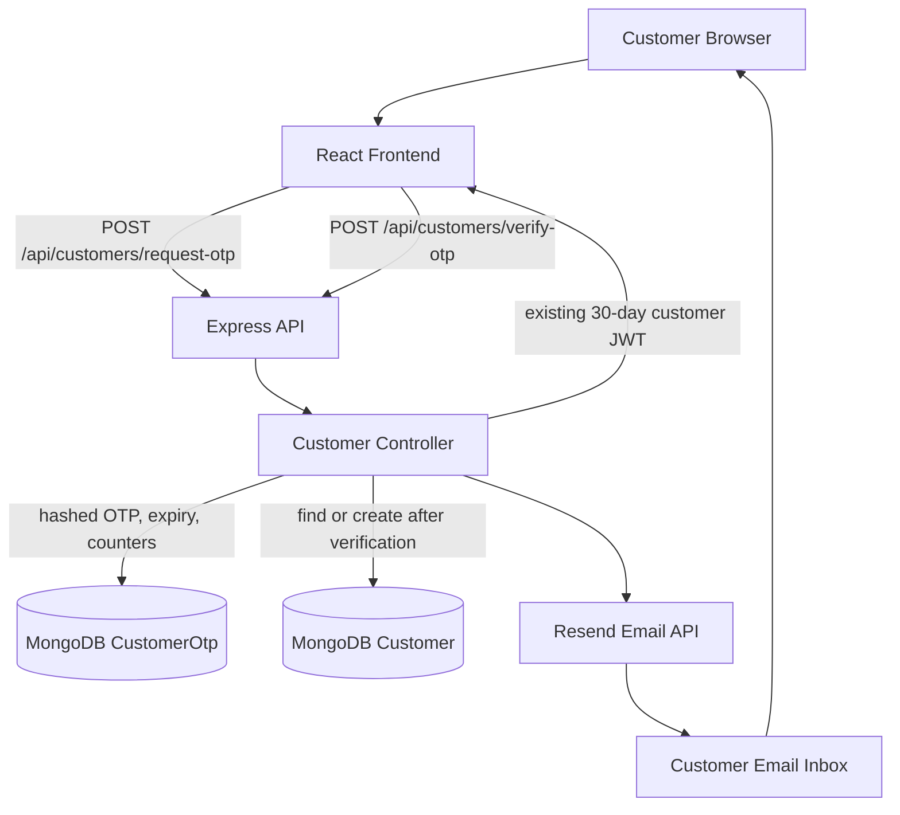

# Email OTP Authentication

**Sindhi Namkeen & Dry Fruits e-commerce**  
**Implementation reference and operational guide**  
**Status:** Implemented in the current workspace; production deployment and full OTP verification testing remain pending.

---

## Contents

1. [Project context](#1-project-context)
2. [Architecture](#2-architecture)
3. [Authentication flow](#3-authentication-flow)
4. [Frontend implementation](#4-frontend-implementation)
5. [Backend implementation](#5-backend-implementation)
6. [API reference](#6-api-reference)
7. [OTP security and limits](#7-otp-security-and-limits)
8. [MongoDB storage](#8-mongodb-storage)
9. [Resend integration](#9-resend-integration)
10. [Environment configuration](#10-environment-configuration)
11. [Testing and verified behavior](#11-testing-and-verified-behavior)
12. [Debugging history](#12-debugging-history)
13. [Production deployment](#13-production-deployment)
14. [Security checklist](#14-security-checklist)
15. [Troubleshooting](#15-troubleshooting)
16. [Relevant files](#16-relevant-files)
17. [Final status](#17-final-status)

## 1. Project context

This project is a MERN e-commerce application: a React storefront, an Express/Node.js API, and MongoDB persistence through Mongoose. Customer account access uses email OTP verification rather than asking customers to create or enter a password in the storefront. This is email verification, not Google OAuth.

The backend verifies an email address before issuing the existing customer JWT. Existing profile, address, cart, checkout, order, and tracking workflows continue to use the customer authentication context and protected customer routes.

## 2. Architecture



In local development, Vite serves the React app on port `3000` and proxies `/api` to the backend on port `5000`. The development-only `frontend/.env.development.local` override makes the API client use its relative `/api` fallback; the production API setting remains separate.

## 3. Authentication flow

1. The customer opens `/login` or `/register`; both paths render `CustomerOtpAuth`.
2. The customer enters an email address and selects **Send OTP**.
3. Express parses the JSON request, applies the global `mongoSanitize` middleware, and applies the OTP request IP limiter.
4. `requestCustomerOtp` trims the address, lowercases it for lookup, and validates it with an email pattern. The original trimmed spelling is used for delivery.
5. The controller creates a cryptographically generated, zero-padded six-digit code using Node.js `crypto.randomInt`.
6. It hashes the code with `bcryptjs` (cost factor 10) and stores the hash, normalized email, expiry, attempt count, delivery count, and last-sent time in `CustomerOtp`.
7. `sendCustomerOtpEmail` sends the code via the Resend Node.js SDK using backend environment variables.
8. The customer enters the code. The frontend submits the email and six-digit string to `/api/customers/verify-otp`.
9. The backend finds an unexpired record, enforces the attempt cap, increments the attempt counter, and compares the submitted code with the stored bcrypt hash.
10. A successful comparison atomically deletes the matching unexpired OTP record. A consumed, expired, malformed, or incorrect code cannot be used to complete authentication.
11. Only after OTP consumption does the controller look up the customer. It returns the existing customer if found, otherwise creates a new one.
12. The controller issues the existing 30-day JWT and returns the customer payload. The frontend stores it using `CustomerAuthContext` and navigates to the requested redirect or home.

New customers are created with the schema defaults (`name: "Customer"`, empty phone, and no saved addresses). Checkout continues to collect delivery details through its existing form/profile flow.

## 4. Frontend implementation

| File | Responsibility |
|---|---|
| `frontend/src/pages/CustomerOtpAuth.jsx` | Two-step email/code experience; loading, error, neutral success notice, OTP input, resend countdown, change-email action, JWT handoff and redirect. |
| `frontend/src/App.jsx` | Maps both `/login` and `/register` to `CustomerOtpAuth`. Existing cart, checkout, orders, and tracking routes remain registered. |
| `frontend/src/services/api.js` | Uses the configured API base; exposes `requestCustomerOtpApi` and `verifyCustomerOtpApi`. The customer token interceptor remains in place for existing protected routes. |
| `frontend/src/context/CustomerAuthContext.jsx` | Stores customer JWT and customer summary in `localStorage` using `sindhi_customer_token` and `sindhi_customer_user`; exposes login/logout/profile update methods. |
| `frontend/src/components/Navbar.jsx` | Shows account state, customer name, logout and account navigation using the existing auth context. |
| `frontend/src/pages/CheckoutPage.jsx` | Continues to require customer authentication and uses the existing customer profile/order APIs. |

The OTP screen has email and verification steps. It shows request/verify loading labels, renders API error messages, uses a numeric six-character input with `one-time-code` autocomplete, and disables verification until six digits are entered. The resend button is disabled for the server-provided 60-second countdown; **Change email** returns to step one. The success notice is brief because successful verification immediately navigates.

## 5. Backend implementation

| File | Responsibility |
|---|---|
| `backend/controllers/customerController.js` | Secure code generation, request validation, OTP record lifecycle, comparison, single-use deletion, customer lookup/creation, JWT generation and response mapping. |
| `backend/routes/customerRoutes.js` | Registers public OTP request and verification endpoints with their respective IP limiters; retains protected profile/address/order routes. |
| `backend/models/Customer.js` | Existing customer schema. Name has a default, password is optional, and phone defaults to an empty string to support email-only signup before checkout collects profile details. Existing email uniqueness and address data remain. |
| `backend/models/CustomerOtp.js` | Separate OTP collection schema, unique normalized email, bcrypt hash, expiry TTL index, attempts, resend count, last-sent timestamp, and timestamps. |
| `backend/utils/sendCustomerOtpEmail.js` | Resend SDK client and professional text/HTML OTP email. Reads only backend `EMAIL_PROVIDER_API_KEY` and `EMAIL_FROM`. On an SDK-returned error it logs only sanitized `name`, `status`, and `code`, then throws the existing generic error. |
| `backend/middleware/rateLimiter.js` | OTP request: 5 requests/IP per 15 minutes. OTP verify: 10 requests/IP per 15 minutes. These use `express-rate-limit` defaults (in-memory store). |
| `backend/middleware/sanitize.js` | Project-local recursive NoSQL input sanitizer. String values have `$` removed while dots are preserved for email addresses; leading `$`/`.` are removed from object keys. |
| `backend/server.js` | Loads backend dotenv, mounts JSON parser and sanitizer, trusts one proxy hop, mounts customer routes at `/api/customers`, and connects MongoDB before listening. |
| `backend/package.json` | Includes the official `resend` Node.js SDK. Scripts are `npm run dev` and `npm start`; there is no dedicated backend test script. |

The Resend helper does not return provider error details to the browser. Its current diagnostic line is emitted only when the SDK returns an `error` value; thrown network/runtime failures instead reach the controller's generic catch without that provider-field line.

## 6. API reference

### `POST /api/customers/request-otp`

**Purpose:** Request delivery of a verification code for an email address.

Request:

```json
{
  "email": "customer@example.com"
}
```

Validation requires a string address matching the controller's email pattern. The address is trimmed and normalized for database lookup. The response does not disclose whether a customer account already exists.

Successful response (`200`):

```json
{
  "success": true,
  "message": "If this address can receive email, a verification code has been sent.",
  "expiresInSeconds": 600,
  "resendAvailableInSeconds": 60
}
```

Known response classes:

| Status | Meaning |
|---|---|
| `400` | Invalid email address. |
| `429` | Request IP limit, per-email 60-second cooldown, or per-active-code delivery cap. |
| `503` | A caught database, configuration, or email-provider exception; the response stays generic. |

### `POST /api/customers/verify-otp`

**Purpose:** Verify a code, consume it, then authenticate an existing customer or create a new customer and authenticate it.

Request:

```json
{
  "email": "customer@example.com",
  "otp": "<SIX_DIGIT_CODE>"
}
```

The OTP must be a string of exactly six decimal digits. Email matching is trimmed and case-normalized.

Successful response (`200`):

```json
{
  "success": true,
  "message": "Email verified successfully.",
  "token": "<CUSTOMER_JWT>",
  "customer": {
    "id": "<CUSTOMER_ID>",
    "name": "<CUSTOMER_NAME>",
    "email": "customer@example.com",
    "phone": "<PHONE_OR_EMPTY>",
    "addresses": []
  }
}
```

Known response classes:

| Status | Meaning |
|---|---|
| `400` | Malformed, incorrect, expired, missing, or already-consumed code. The message is intentionally generic. |
| `429` | Verification IP limit or the per-code incorrect-attempt limit has been reached. |
| `500` | Caught database or verification exception; the response is generic. |

The token is a signed JWT with customer `id`, `email`, `name`, and `role: "customer"` claims and a 30-day lifetime. The protected customer middleware reads it from the `Authorization: Bearer` header.

## 7. OTP security and limits

- **Generation:** `crypto.randomInt(0, 1_000_000)`, converted to a six-character zero-padded decimal string.
- **At-rest protection:** Only a bcrypt hash is saved; bcrypt cost factor is 10. Plaintext is passed to the email sender and is not returned by the request endpoint.
- **Expiry:** Ten minutes. Verification also queries `expiresAt > now`; TTL deletion is cleanup, not the sole expiry check.
- **Single use:** A matching, still-valid record is deleted before customer lookup/creation and JWT issuance.
- **Incorrect attempts:** Maximum of five comparisons per active record. The attempt counter is incremented before bcrypt comparison; after the cap, verification returns `429`.
- **Resend interval:** A minimum of 60 seconds between deliveries for the same active email record.
- **Delivery cap:** `resendCount` begins at one for the first send. It allows at most three sends for an active code window (initial delivery plus up to two resends). An expired record resets the counter when reused.
- **IP limits:** Request endpoint 5/IP/15 minutes; verification endpoint 10/IP/15 minutes. The limiter uses its default process-memory store, so counters are not shared across multiple backend instances and reset when the process restarts.
- **Enumeration:** OTP request does not look up the Customer collection and uses a generic successful message. Invalid input and throttling still have distinct responses.
- **Secrets:** Provider credentials belong only in backend environment variables. The frontend uses API helpers and never receives the provider key.
- **Logging:** OTP and API key are not explicitly logged. Resend SDK-returned failures produce only the diagnostic fields; the controller returns generic messages.

## 8. MongoDB storage

`CustomerOtp` is a separate Mongoose model/collection; its unique key is the normalized email address. Stored fields:

| Field | Purpose |
|---|---|
| `email` | Normalized address used to locate the active code; unique. |
| `otpHash` | bcrypt hash only; never the plaintext code. |
| `expiresAt` | Expiry timestamp and MongoDB TTL index (`expires: 0`). |
| `attempts` | Incorrect/ongoing verification attempt counter; defaults to zero. |
| `resendCount` | Delivery counter for the active code; starts at one. |
| `lastSentAt` | Server-side resend cooldown reference. |
| `createdAt`, `updatedAt` | Mongoose timestamps. |

There is no Customer foreign key: the OTP is tied to an email before a customer may exist. The Customer collection is queried only after OTP verification succeeds. MongoDB's TTL monitor removes expired OTP documents asynchronously; the controller independently rejects expired records immediately. No destructive migration is part of this implementation.

## 9. Resend integration

The backend uses the official `resend` package (`Resend` class) from `backend/utils/sendCustomerOtpEmail.js`. It sends a text and HTML message branded **Sindhi Namkeen & Dry Fruits**, with the code, ten-minute expiry, and a warning not to share the code. It sends to the trimmed email entered by the customer and reads:

- `EMAIL_PROVIDER_API_KEY`
- `EMAIL_FROM`

The current example sender is `onboarding@resend.dev`. Resend documents this shared test sender as restricted to the email address associated with the Resend account. A normal customer Gmail recipient requires a domain verified in Resend and a sender address on that verified domain. The API key's sending permission is not a substitute for domain verification.

For local testing with the shared sender, the recipient must be the Resend account email. A `200` from the application means the SDK send call resolved; it does not itself verify inbox placement. Confirm delivery in the inbox or Resend dashboard. To test an arbitrary Gmail recipient, use a verified sending domain and matching `EMAIL_FROM`.

## 10. Environment configuration

Never put these values in frontend variables or source control. `backend/.env` is the local backend environment file and is ignored by Git. Render variables belong to the backend service's environment settings.

Local backend example (placeholders only):

```dotenv
EMAIL_PROVIDER_API_KEY=<RESEND_API_KEY>
EMAIL_FROM=<VERIFIED_SENDER_EMAIL>
MONGODB_URI=<MONGODB_CONNECTION_STRING>
JWT_SECRET=<LONG_RANDOM_JWT_SECRET>
```

Render backend environment:

```text
EMAIL_PROVIDER_API_KEY = <RESEND_API_KEY>
EMAIL_FROM = <VERIFIED_SENDER_EMAIL>
JWT_SECRET = <LONG_RANDOM_JWT_SECRET>
MONGODB_URI = <MONGODB_CONNECTION_STRING>
```

`backend/.env.example` currently provides blank `EMAIL_PROVIDER_API_KEY` and `onboarding@resend.dev` as `EMAIL_FROM`; replace the sender value in the live environment with a verified-domain sender for production customer delivery. Do not copy a real key into this documentation.

The backend code currently has a fallback when `JWT_SECRET` is missing. Production must explicitly configure a strong secret; do not rely on an application fallback. Local frontend API routing uses Vite's `/api` proxy to local port `5000`; the development-only API override is separate from the existing deployed frontend API configuration.

## 11. Testing and verified behavior

### Performed

- Backend syntax checks for the touched authentication/sanitizer/server modules passed during implementation.
- Node built-in automated test run reported 2 passing tests: the dotted-email sanitizer regression and route-loading smoke check (`backend/test-track.js`).
- Frontend production build passed repeatedly after storefront/auth integration changes.
- The sanitizer regression test verified that `test@gmail.com` reaches the downstream handler unchanged while `$` sanitization remains active.
- Local OTP request with an empty JSON body returned the expected `400` email-validation response through both the backend and Vite proxy; this did not send an email.
- At least one local request returned `200` from the OTP request endpoint, confirming that the sender call resolved. A later request returned Resend `validation_error` / `403` for the test sender restriction.
- A read-only Mongo query observed a recently active OTP record with `resendCount: 1` and `attempts: 0`; email and hash fields were excluded from the query output.
- Resend read-only logs were not available with a send-only key; the documented logs endpoint returned `401 restricted_api_key`.

### Not verified

- No OTP code was submitted to `/verify-otp`; correct-code login/signup, incorrect-code rejection, expiry, reuse rejection, and account creation timing have not been end-to-end exercised.
- Inbox delivery/placement was not independently confirmed; an API-accepted send is not proof the message appeared in the inbox.
- The IP and per-email rate limits were inspected in code but not driven to their thresholds in automated tests.
- Production Render deployment and authentication against the deployed API have not been verified.

## 12. Debugging history

1. **Email dot sanitization:** The project-local `mongoSanitize` originally removed dots from scalar strings, corrupting addresses before OTP validation. It now removes `$` from values while preserving dots; `backend/middleware/sanitize.test.js` guards `test@gmail.com`.
2. **Local frontend called Render:** A local `VITE_API_URL` override pointed requests at the deployed backend. A development-only `frontend/.env.development.local` override makes development use the existing Vite `/api` proxy; the deployed API configuration was left separate.
3. **Render returned route 404:** A request to the configured deployed OTP path returned `{"success":false,"message":"API route not found"}`. The local backend route was present. Deploy the backend containing the current route/controller before using OTP on Render.
4. **Resend 403:** The Resend diagnostic recorded `validation_error`, HTTP `403`, with no code. Resend's official guidance associates this with the `resend.dev` testing-sender recipient restriction. Use the Resend account email for a test, or verify a custom domain and send from that domain for other recipients.
5. **Send-only key and log lookup:** A read-only logs request was rejected as `restricted_api_key` because the API key is send-only. This prevents querying Resend logs; it does not by itself indicate that email sending permission is absent.
6. **Generic 503:** Request exceptions are caught by the controller and return a generic message. For an SDK-returned send error, the sender logs only sanitized `name`, `status`, and `code`; network exceptions thrown before an SDK error object is returned do not produce that diagnostic line.

## 13. Production deployment

1. Deploy the backend source containing the OTP model, controller, routes, sanitizer fix, and Resend helper to Render.
2. Add `EMAIL_PROVIDER_API_KEY` and `EMAIL_FROM` to the Render **backend** service environment. Also set the existing backend `JWT_SECRET` and `MONGODB_URI` securely; never expose them in the frontend.
3. Add and verify a domain in Resend by configuring its required DNS records.
4. Set `EMAIL_FROM` to an address on that exact verified domain.
5. Redeploy/restart the backend so it loads the new environment.
6. Test with a real customer email, then confirm message delivery, code verification, JWT persistence after refresh, existing-customer login, and new-customer creation.
7. Verify profile/address, cart, checkout/COD order placement, order history, and tracking after authentication.
8. Confirm existing MongoDB customers and orders remain present; no migration or destructive data operation is required for the OTP collection.
9. Verify the production frontend still points to the intended Render API and that the deployed backend exposes the OTP routes.

The current implementation is in the workspace; production deployment is not confirmed. A prior deployed-route check returned 404, so deployment remains a required step.

## 14. Security checklist

- [ ] Store `EMAIL_PROVIDER_API_KEY`, `EMAIL_FROM`, `JWT_SECRET`, and `MONGODB_URI` only in backend environment settings.
- [ ] Use a Resend-verified domain and sender for production customers.
- [ ] Confirm the sending API key has the intended minimum sending permission.
- [ ] Set a strong, unique `JWT_SECRET` in production; do not rely on code fallback behavior.
- [ ] Confirm `.env` files remain ignored and are not committed.
- [ ] Keep OTP response payloads free of the code and provider credentials.
- [ ] Keep logs limited to sanitized provider diagnostic fields; never log request bodies or OTP values.
- [ ] Confirm the MongoDB TTL index exists for `CustomerOtp.expiresAt` and that controller expiry checks remain enabled.
- [ ] Review proxy trust and IP rate-limit behavior when changing hosting topology or adding backend replicas.
- [ ] Verify resend, incorrect-attempt, and IP throttles in a controlled staging test.
- [ ] Monitor Resend send logs/delivery events using an appropriately scoped operational credential, without exposing that credential to the frontend.
- [ ] Verify customer JWT role validation and protected routes before production release.

## 15. Troubleshooting

| Symptom | Likely cause/check |
|---|---|
| `API route not found` | Frontend may target an older Render deployment. Check that the backend is deployed with `/api/customers/request-otp` and `/api/customers/verify-otp`; verify Vite `/api` proxy when testing locally. |
| Resend `403 validation_error` | With `onboarding@resend.dev`, recipient is not the Resend account email, or the sender/domain does not meet Resend restrictions. Verify a domain and use a sender on it for arbitrary recipients. |
| Request returns generic `503` | The controller catches missing provider config, database failures, thrown network errors, and email failures with the same response. Check backend logs for the sanitized `[Resend send failure]` fields when available; check startup/database health and backend environment variable presence without printing values. |
| Verify returns generic invalid/expired `400` | Email mismatch, malformed/wrong code, expiry, absent record, consumed code, or a concurrent consume. Request a fresh code if permitted. |
| Verify returns `429` | Verification IP limit or per-code incorrect-attempt cap. Wait/reset through the normal expiry and resend process. |
| Request returns `429` | Request IP limit, active-email 60-second cooldown, or active code delivery cap. Wait for the indicated interval/window. |
| Local email is invalid despite a dotted domain | Confirm `mongoSanitize` preserves dots in scalar strings; run `node --test middleware/sanitize.test.js` from `backend`. |
| Local frontend calls the wrong API | In Vite development, use the development-only API override and existing `/api` proxy. Do not change the production `VITE_API_URL` setting to fix local routing. |
| Provider configuration is missing | Set `EMAIL_PROVIDER_API_KEY` and `EMAIL_FROM` on the backend process, then restart/redeploy. Never print their values while debugging. |

## 16. Relevant files

| Path | Role |
|---|---|
| `frontend/src/pages/CustomerOtpAuth.jsx` | Customer email and OTP UI. |
| `frontend/src/App.jsx` | `/login` and `/register` route mapping. |
| `frontend/src/services/api.js` | OTP request/verify client methods and API base selection. |
| `frontend/src/context/CustomerAuthContext.jsx` | JWT/customer local persistence and login/logout state. |
| `frontend/src/components/Navbar.jsx` | Customer account display/logout and existing navigation. |
| `frontend/src/pages/CheckoutPage.jsx` | Protected checkout profile/order behavior after login. |
| `backend/controllers/customerController.js` | OTP request/verify, customer creation/lookup, JWT issuance. |
| `backend/routes/customerRoutes.js` | OTP routes and route-specific limiter application. |
| `backend/models/Customer.js` | Customer profile/account model. |
| `backend/models/CustomerOtp.js` | Hashed OTP state and TTL schema. |
| `backend/utils/sendCustomerOtpEmail.js` | Resend sender and sanitized provider diagnostics. |
| `backend/middleware/rateLimiter.js` | Per-IP request/verification limits. |
| `backend/middleware/sanitize.js` | NoSQL sanitizer preserving dotted email values. |
| `backend/middleware/sanitize.test.js` | Regression test for dotted email preservation. |
| `backend/middleware/customerAuthMiddleware.js` | JWT verification for protected customer routes. |
| `backend/server.js` | Middleware order and `/api/customers` mount. |
| `backend/config/db.js` | MongoDB connection initialization. |
| `backend/package.json` | Backend runtime dependencies/scripts, including Resend. |
| `backend/.env.example` | Safe backend email-variable example; no real key. |
| `frontend/vite.config.js` | Existing local `/api` proxy. |
| `frontend/.env.development.local` | Local-only API-base override; ignored by Git. |

## 17. Final status

| Status | Details |
|---|---|
| Implemented in workspace | Email OTP request/verification endpoints, bcrypt-hashed OTP storage, expiry/attempt/resend checks, Resend integration, customer JWT response, frontend OTP page, sanitizer dot fix, and local Vite API routing. |
| Tested locally | Backend syntax/diagnostics, Node tests, frontend production builds, request validation, local route/proxy behavior, Mongo OTP metadata persistence, and at least one Resend API-accepted OTP request. |
| Not fully tested | Full OTP verification and JWT-refresh flow, failure/expiry/reuse/threshold paths, inbox delivery confirmation, and production customer delivery. |
| Deployed | Not confirmed. A prior Render OTP route probe returned 404. |
| Remaining | Deploy the backend; configure Render email/JWT/Mongo variables; verify a Resend sending domain and matching sender; then run the production checklist and end-to-end auth/order tests. |
